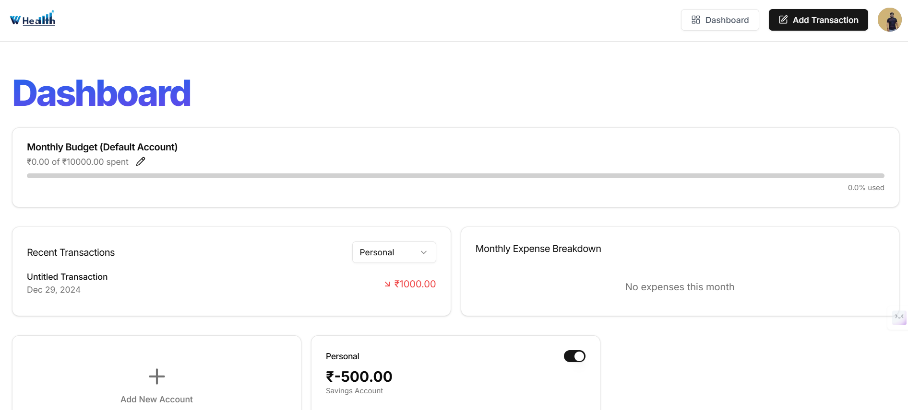

# WHealth Finance Web App Documentation
Welcome to the guide. This document outlines the application features, functionalities, and usage guidelines to help you manage your finances effectively.

## Table of Contents
- [WHealth Finance Web App Documentation](#whealth-finance-web-app-documentation)
  - [Table of Contents](#table-of-contents)
  - [Introduction](#introduction)
  - [Features](#features)
    - [Dashboard](#dashboard)
    - [Expense Tracking](#expense-tracking)
    - [Budget Planning](#budget-planning)
    - [Investment Profolio Management](#investment-profolio-management)
    - [Financial Goal Setting](#financial-goal-setting)
    - [Reports and Analytics](#reports-and-analytics)
    - [Notifications and Reminders](#notifications-and-reminders)
  - [Getting Started](#getting-started)
    - [System Requirements](#system-requirements)
    - [Account Registration](#account-registration)
    - [Logging In](#logging-in)
  - [Support](#support)
  - [Frequently Asked Questions (FAQs)](#frequently-asked-questions-faqs)

## Introduction
Whealth Finance is a comprehensive web application designed to assist users in managing their personal finances. It offers tools for tracking expenses, planning budgets, managing investments, setting financial goals, and analyzing financial health through detailed reports.

## Features
### Dashboard
The dashboard provides an overview of your financial status, including:
- **Account Balances**: Displays balances across various accounts.
- **Recent Transactions** : Lists your most recent financial activities.
- **Financial Summary** - Summarizes income, expenses, and savings.

### Expense Tracking
Monitor and categorize your expenditures to understand spending patterns:
- **Add Expenses**: Input expenses manually or import from receipts or bank statements.
- **Categorization**: Assign categories to expenses for better analysis.
- **Expense History**: View and edit past expenses.

### Budget Planning
Plan and monitor your budgets to achieve financial stability:
- **Create Budgets**: Set budget limits for different categories.
- **Track Changes**: Monitor actual spending against budgeted amounts.
- **Adjust Budgets**: Modify budget limits as needed.

### Investment Profolio Management
Manage and analyze your investment portfolio:
- **Add Investments**: Input details of your investments.
- **Portfolio Overview**: View the performance of your investments.
- **Asset Allocation**: Analyze the distribution of your assets.

### Financial Goal Setting
Define and track your financial objective:
- **Set Goals**: Establish financial goals. For example, savings for a vacation, planning for a foreign tour, buying a new property, etc.
- **Progress tracking**: Monitor progress towards achieving goals.

### Reports and Analytics
Gain insights into your financial health through detailed reports:
- **Expense Reports**: Analyze spending by category, time period, etc.
- **Income Reports**: Review income sources and trends.
- **Investment Reports**: Evaluate investment performance.

### Notifications and Reminders
Stay informed with timely alerts:
- **Payment Reminder**: Receive alerts for upcoming bills.
- **Budget Alerts**: Get notified when nearing budget limits. 
- **Custom Notifications**: Set personalized financial remainders.

## Getting Started
### System Requirements
- **Web Browser**: Latest version of Chrome, Firefox, Safari, or Edge.
- **Internet Connection**: Stable internet access.

### Account Registration

To create a new account on Whealth, follow the steps below:
- Step 1: Open the Sign-In Page
 
  1. Visit the [Whealth Finance website](https://whealth-finance.vercel.app/) and click on Login button located at the top right corner of the homepage.
  2. You will be directed to the Sign-In page.

- Step 2: Create Your Account
  
  1. Locate the text that says "Don't have an account? Sign up" at the bottom.
  2. Click on "Sign up" to be redirected to the Sign-Up page.
  3. Follow the on-screen instructions to complete the sign-up process, and agree to the terms and conditions.
  4. Click "Register" to create your account.

- Step 3: Verify Your Email
  1. Check your email inbox for a verification email from Whealth.
  2. Click on the verification link provided in the email to verify your account.

### Logging In
1. Navigate to the [Whealth Finance login page](https://whealth-finance.vercel.app/sign-in?sign_in_force_redirect_url=https%3A%2F%2Fwhealth-finance.vercel.app%2Fdashboard&redirect_url=https%3A%2F%2Fwhealth-finance.vercel.app%2F)
   
2. On the Sign-in page, you will have two options:
    - **Sign in with Google**: Click the **Continue with Google** button and follow the prompts to sign in using your Google account.
    - **Sign in with Email**: Enter you email address in the "Email address" field and click the **Continue** button.

[comment]: # ## Support
[comment]: # For assistance, visit the [Support Center](https://whealth-finance.vercel.app/support) or contact our support team at support@whealth-finance.vercel.app

[comment]: # ## Frequently Asked Questions (FAQs)
[comment]: # **Q1: Is Whealth Finance free to use?**

[comment]: # A1: Yes, Whealth Finance offers a free basic plan. Premium features are available through subscription.

[comment]: # **Q2: Can I link bank account to Whealth Finance?**

[comment]: # A2: Currently, bank account linking is not supported. You can manually import bank statements.

[comment]: # **Q3: How do I reset my password?**

[comment]: # A3: Click on **Forgot Password** on the login page and follow the instructions to reset your password.

